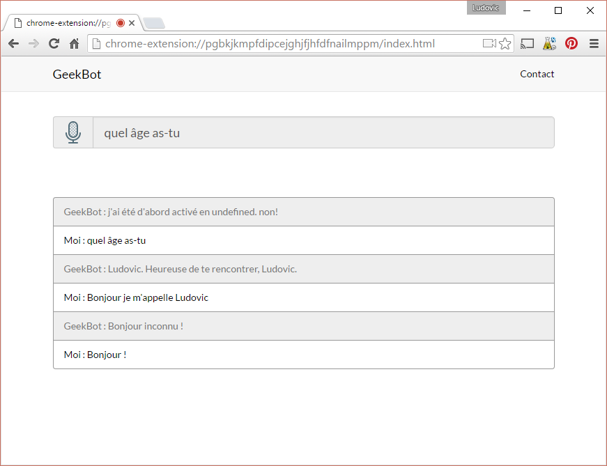

# GeekBot

A chat bot with Text to speech and speech to text feature based on __Chrome.tts__ and __WekbitSpeechRecognition API__.
The chat bot uses an instance of [Program-O](https://github.com/Program-O/Program-O) for the AI.

The app must be loaded as a __Chrome extension__.

